# Structure from motion
This repository follows P3DV at ETH Zurich. I implement the structure from motion pipeline in python. I mainly use two libraries, python-opencv and scipy.

## Structure
- matlab-code: the provided framework in matlab
- python-code: my source files in python
- fountain.ipynb: logs of fountain reconstruction
- south_building.ipynb: logs of south_building reconstrcution, the data is available [here](https://onedrive.live.com/?authkey=%21AAQumsDDwZBIW3w&id=C58A258D760E1B58%2146879&cid=C58A258D760E1B58)
- zurich.ipynb: logs of square reconstruction 
- pave.ipynb: some tests, I didn't clean the code there
- To run it for other datasets, we only need to modify the init() function and to specify the image folder and camera intrinsics as well as the thresholds.

## Implementation details
- Image undistortion: I find that on my own dataset, after undistorting the images, the initialization is even worse, this also indicates that the camera intrinsics maybe not accurate, otherwise it will not fail the initialization
- Feature extraction: SIFT works better than SURF. As to computation time, it's around 1.5 times of SURF
- Feature matching: FLANN is much faster than Brute Force. I follow the default setting for SIFT
- Ratio test: I set the threshold to be 0.65
- Initialization: I use two frames with most image pairs for initialization. I also tries manually assign two frames with large baselines, but it staill failed. So I don't think it's a problem of initialization
- Outlier filtering: I filter outliers by 2D reprojection error and the distance of the reconstructed 3D point to the origin. Afterwards these two steps, those 3D points with only one observation is also filtered. 
- threshold: I set both reprojection error threshold and ransacnPnP threshold to be 5 for fountain and south_building. For our square I use much bigger thresholds but still failed.
- BA: I use the jacabian sparsity matrix to speed up. As to the loss, soft_l1 loss works better than huber loss in my implementation. 
- mean track length: The mean track length for fountain is over 3 and for south building is over 4, but for our dataset it's near 2. The reason is too many observations are filtered, though with big thresholds.

## Results
I can successfully reconstruct the fountain and the south building, reconstruction of the square completely failed. One reason could be that my algorithm is not good enough, another reason is that the camera intrinsics is not accurate. One thing I can do is adding the camera intrinsics to the bundle adjustment, then I should also add constraint to BA as the intrinsics for all the frames are the same. 

### South building
I use 40 frames, there are in total 1.28M observations and 0.36M reconstructed points, the mean reprojection error is 0.01pixel. The complete result is in results/south_building

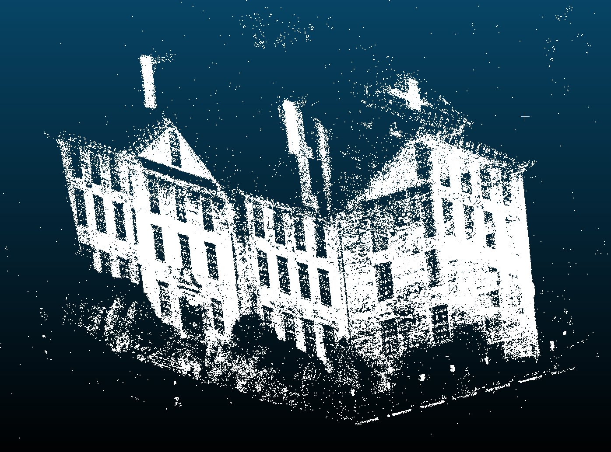
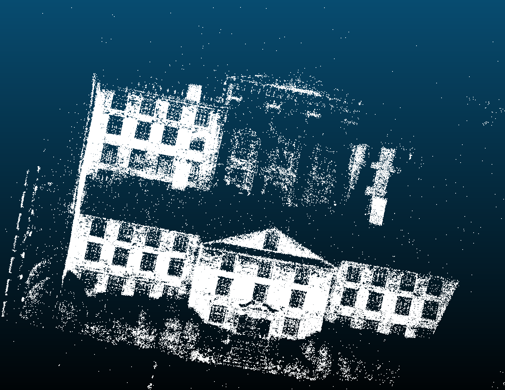
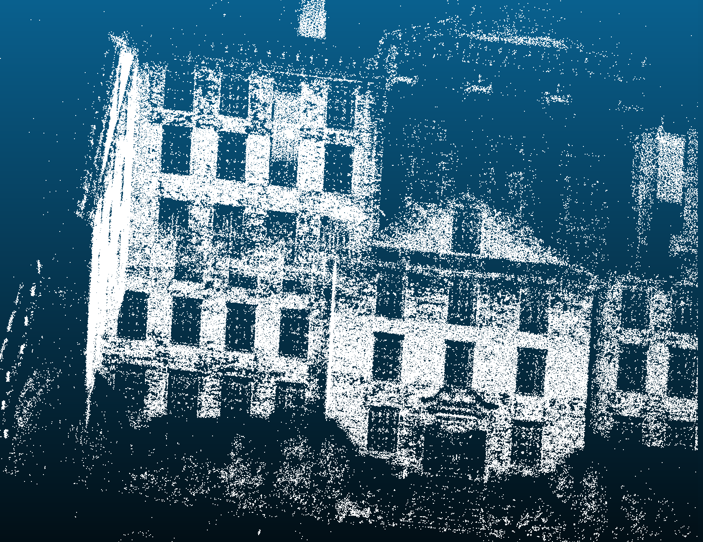
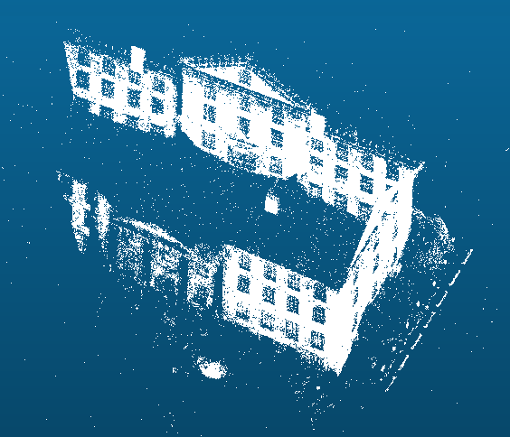
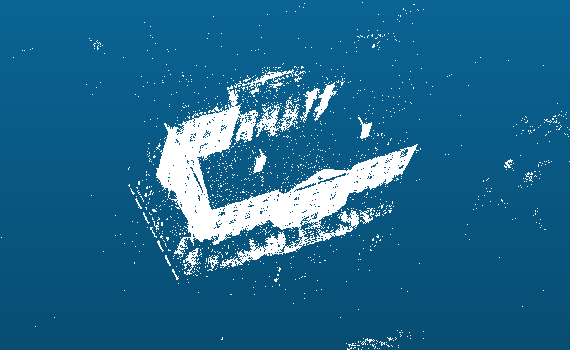
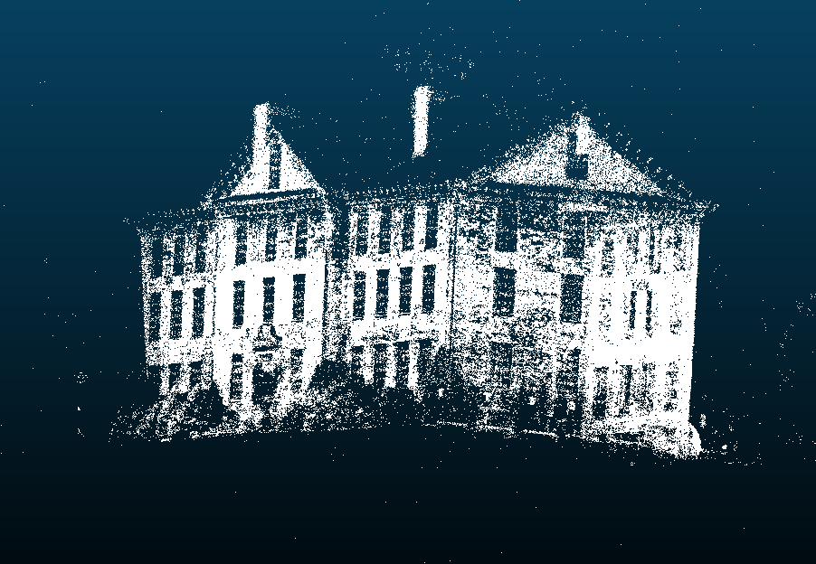
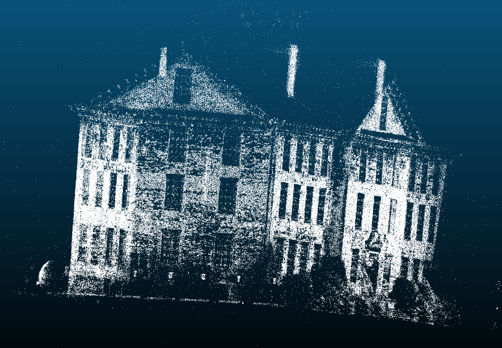
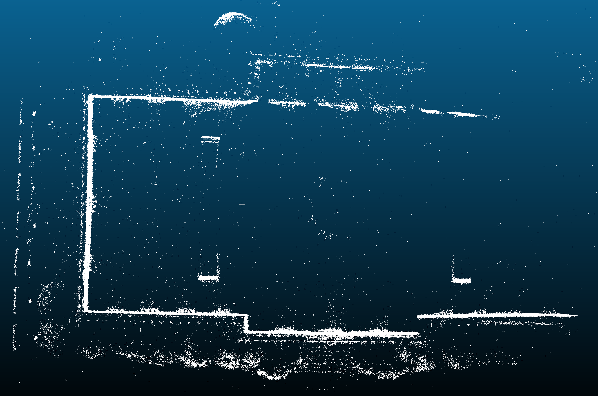
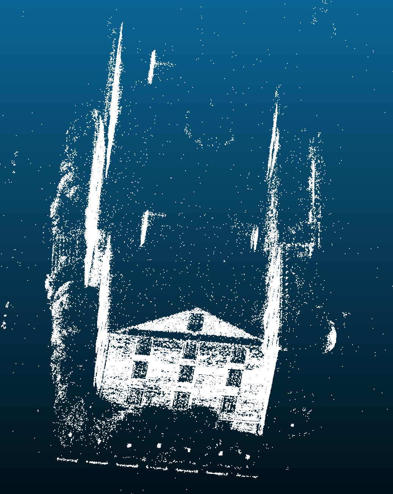
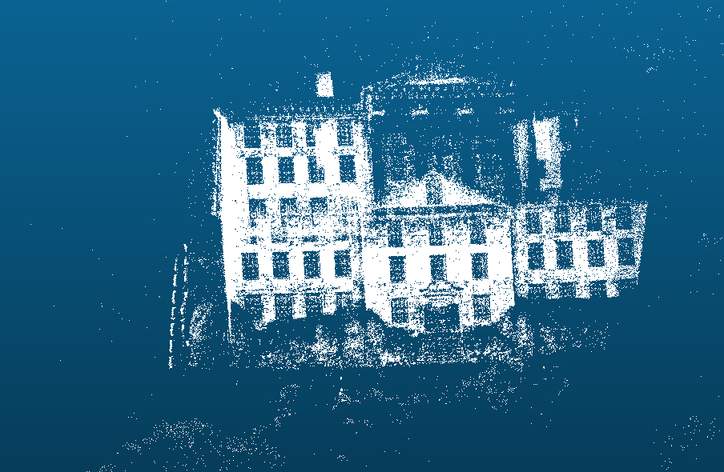
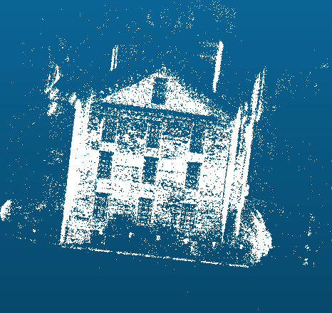